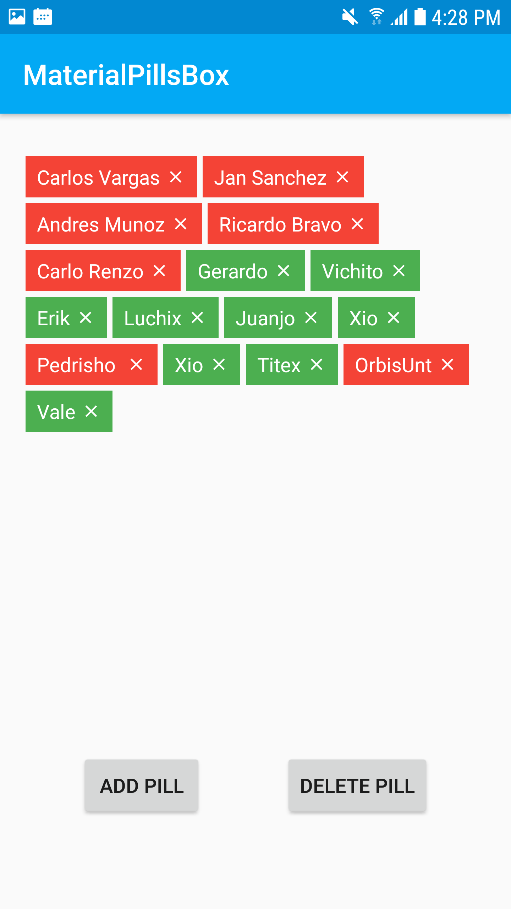
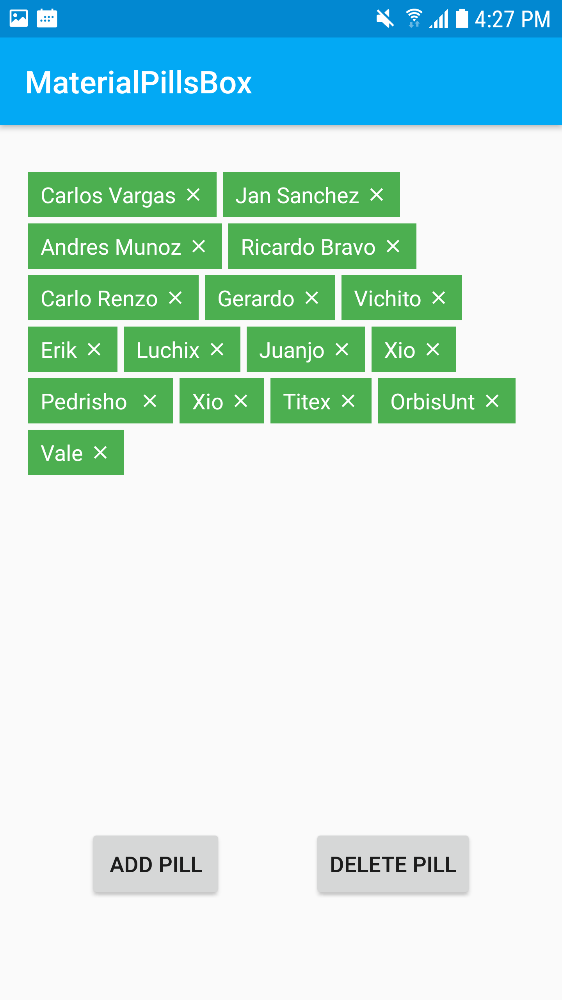
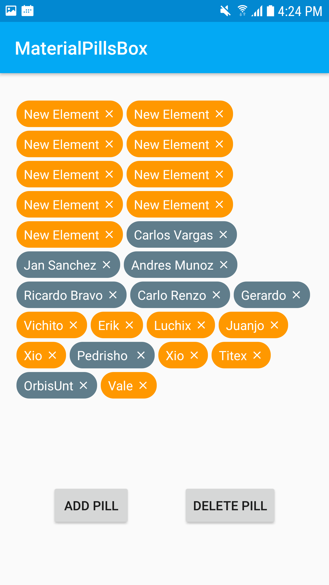
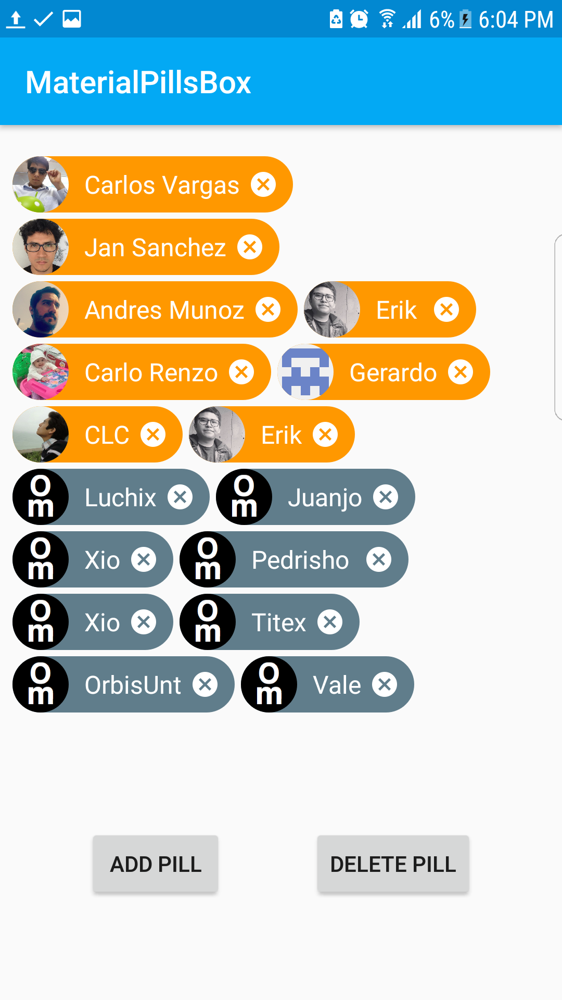

<h1 align="center">MaterialPillsBox Widget</h1>

<p align="center">
    <a target="_blank" href="https://jitpack.io/#orbismobile/android-MaterialPills"></a>
</p>

<p align="center">
    
</p>

<p align="center">
    
    
    
    
</p>

MaterialPillsBox is a widget that allows you to implement a list of any objects
and show them like a pills with a little material style.

# Gradle
#### Step 1

```
android {
 ...
    allprojects {
        repositories {
            ...
            maven { url 'https://jitpack.io' }
        }
    }
}
```
#### Step 2

```
    dependencies {
        ...
        compile 'com.github.orbismobile:android-MaterialPills:1.0'
    }
```

# Usage

```xml
<pe.orbis.materialpillsbox.MaterialPillsBox
            android:id="@+id/mtbArea"
            android:layout_width="match_parent"
            android:layout_height="40dp"
            app:closeIcon="@drawable/ic_edit_white_24dp"
            app:closeIconPadding="@dimen/default_close_icon_margin"
            app:maxPills="20"
            app:pillSelectedBackground="@drawable/shape_button_pill_red"
            app:pillSelectionMode="multi"
            app:showCloseIcon="true"
            app:pillTextColor="@color/md_amber_500"
            app:pillMarginBottom="10dp"/>
```


# Setup
For using the MaterialPillBox widget in your Activity, just implement the initFirstSetup()`
  
# The PillEntity class                          
Any of your entities have to extend the `PillEntity` class(this is the baseEntity). This class contains 
3 basic attributes which are: 

* id(int): Unique Id for your pill
* message(String): Message to show in the pill
* pressed(boolean): State of the pill.

# Main Properties

##### maxPills
    The maximum number of pills, the default value is 20
##### pillBackground
    The pill's brackground so you can add any drawable to your pills
##### pillSelectedBackground
    The pill's brackground when is selected so you can add any drawable to your pills
##### showCloseIcon
    If you wanna show the close icon of the pill
##### closeIcon
    Set any icon for the pill
##### closeIconPadding
    The separation between pill's message and the close icon
#### pillSelectionMode
    We have two selection mode, multiselection and none selection


License
=======

    MIT License
    
    Copyright (c) 2017 Orbis Mobile
    
    Permission is hereby granted, free of charge, to any person obtaining a copy
    of this software and associated documentation files (the "Software"), to deal
    in the Software without restriction, including without limitation the rights
    to use, copy, modify, merge, publish, distribute, sublicense, and/or sell
    copies of the Software, and to permit persons to whom the Software is
    furnished to do so, subject to the following conditions:
    
    The above copyright notice and this permission notice shall be included in all
    copies or substantial portions of the Software.
    
    THE SOFTWARE IS PROVIDED "AS IS", WITHOUT WARRANTY OF ANY KIND, EXPRESS OR
    IMPLIED, INCLUDING BUT NOT LIMITED TO THE WARRANTIES OF MERCHANTABILITY,
    FITNESS FOR A PARTICULAR PURPOSE AND NONINFRINGEMENT. IN NO EVENT SHALL THE
    AUTHORS OR COPYRIGHT HOLDERS BE LIABLE FOR ANY CLAIM, DAMAGES OR OTHER
    LIABILITY, WHETHER IN AN ACTION OF CONTRACT, TORT OR OTHERWISE, ARISING FROM,
    OUT OF OR IN CONNECTION WITH THE SOFTWARE OR THE USE OR OTHER DEALINGS IN THE
    SOFTWARE.


